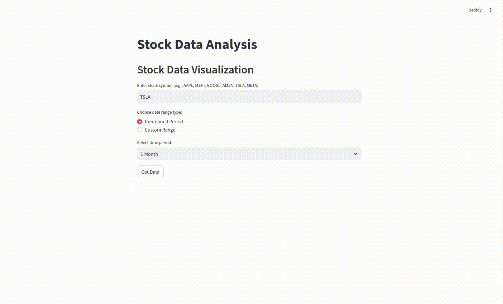
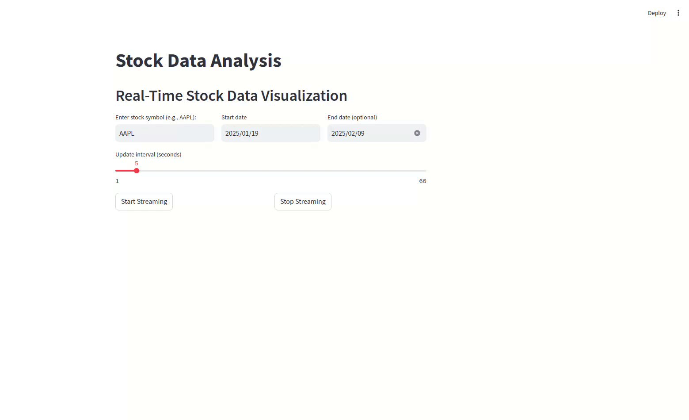
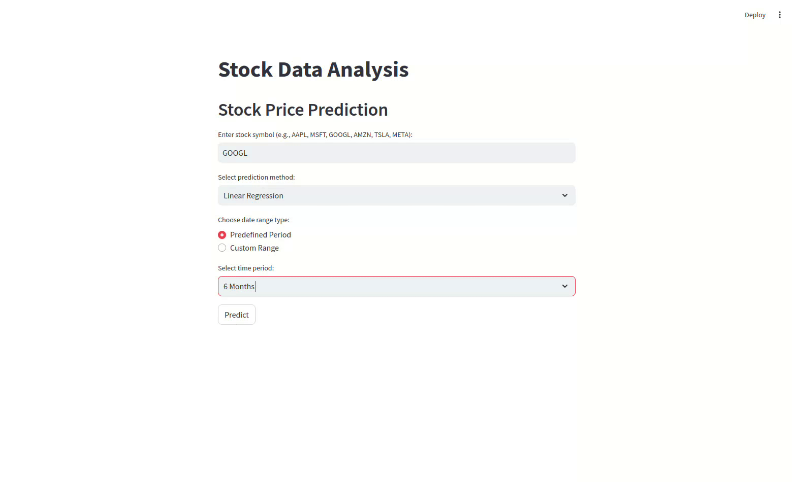

### Description
This application provides a fast and efficient way to analyze selected stocks. You can:

- **View Historical Metrics**: Analyze stock performance over a specified period.
  

- **Monitor Real-Time Prices**: Track stock prices as they change in real time.
  

- **Make Predictions**: Utilize linear regression or exponential moving averages to forecast future closing prices.
  

### Launch
To build and run the Docker container, use the following command:
```
docker-compose up --build
```
After the build completes, navigate to `http://localhost:8501/` in your web browser to access the application.
